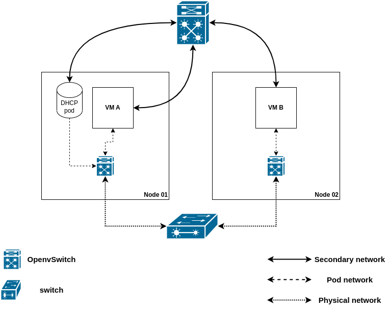

# ovn-k-secondary-net-dhcp
How to deploy a secondary network overlay in Kubernetes for VMs with a DHCP
server workload.

## Introduction
In this post we will create a secondary network to provide east/west
connectivity between Openshift Virtualization Virtual Machines. For that, we
will create an overlay network (disconnected from the nodes physical network),
and deploy a DHCP server in a pod connected to that network, which will offer
IP addresses for the VM workloads. Keep in mind configuring IP address
management (IPAM) in a network attachment definition for virtual machines is
**not** supported.

Finally, keep in mind this SDN approach - which uses virtual networking
infrastructure - does not require provisioning VLANs or any other physical
network resources. As such, any scenarios requiring access to the node's
physical network cannot be met by the `layer2`topology presented in this post.

## Open Virtual Network
OVN (Open Virtual Network) is a series of daemons for the Open vSwitch that
translate virtual network configurations into OpenFlow. It provides virtual
networking capabilities for any type of workload on a virtualized platform
(virtual machines and containers) using the same API.

OVN provides a higher-layer of abstraction than Open vSwitch, working with
logical routers and logical switches, rather than flows. More details can be
found in the OVN architecture
[man page](https://www.ovn.org/support/dist-docs/ovn-architecture.7.html).

In essense, it is an SDN control plane for Open vSwitch.

## Requirements
- Openshift cluster, version >= 4.13
- [OVN Kubernetes CNI](https://docs.openshift.com/container-platform/4.13/networking/ovn_kubernetes_network_provider/about-ovn-kubernetes.html) configured as the default network provider
- a default `StorageClass`.

## Personas
- VM user: person that creates and runs virtual machines. Must ask the `network
  admin` for the attachment names for the networks to which the VMs will connect
  to.
- network admin: person with cluster network admin permissions. They can create
  `network-attachment-definitions`. 

## The overlay definition
Provision the following yaml to define the overlay which will configure the
secondary attachment for the KubeVirt VMs.

Please refer to the
[Openshift documentation](https://docs.openshift.com/container-platform/4.14/networking/multiple_networks/configuring-additional-network.html#configuration-ovnk-network-plugin-json-object_configuring-additional-network)
for details into each of the knobs.

```bash
cat <<EOF | oc apply -f -
apiVersion: k8s.cni.cncf.io/v1
kind: NetworkAttachmentDefinition
metadata:
  name: flatl2
spec:
apiVersion: k8s.cni.cncf.io/v1
kind: NetworkAttachmentDefinition
metadata:
  name: flatl2
spec:
    config: |2
      {
        "cniVersion": "0.3.1",
        "name": "flatl2",
        "netAttachDefName": "default/flatl2",
        "topology": "layer2",
        "type": "ovn-k8s-cni-overlay"
      }
EOF
```

The above example will configure a cluster-wide overlay network on layer 2.
This means the users are responsible for providing the VM's IP addresses for
the overlay network - either manually, via `cloud-init`, of by deploying a DHCP
server in the overlay network.
In [deploying the DHCP server](#deploying-the-dhcp-server), we show a simple way
of achieving the latter.

The overall idea of the scenarios is depicted in the following image:


In it, the pod network is used to access the outside world (e.g. internet), and
Kubernetes services, while the secondary network is used for communication
between the virtual machines - e.g. an application running on `VMA` accesses a
database deployed on `VMB`.

It is also worth to point out the value of the `netAttachDefName` attribute must
match the `namespace/name` of the surrounding `NetworkAttachmentDefinition`
object.

**NOTE:** this step requires cluster network admin permissions. Can only be
performed by the network admin.

## Deploying the DHCP server
Once the network definition is provisioned, the network administrator should
deploy the DHCP server. Use the following yaml for that:
```bash
cat <<EOF | oc apply -f -
---
kind: ConfigMap
apiVersion: v1
metadata:
  name: dhcp-server-conf
data:
  dhcpd.conf: |
    authoritative;

    default-lease-time 86400;
    max-lease-time 86400;

    subnet 192.168.123.0 netmask 255.255.255.0 {
            range 192.168.123.2 192.168.123.254;
            option broadcast-address 192.168.123.255;
    }
---
apiVersion: v1
kind: PersistentVolumeClaim
metadata:
  name: dhcp-db
spec:
  accessModes:
    - ReadWriteOnce
  resources:
    requests:
      storage: 1Gi
---
apiVersion: apps/v1
kind: Deployment
metadata:
  name: dhcp-server
  labels:
    app: dhcp
spec:
  replicas: 1
  selector:
    matchLabels:
      app: dhcp
  template:
    metadata:
      labels:
        app: dhcp
      annotations:
        k8s.v1.cni.cncf.io/networks: '[
          {
            "name": "flatl2",
            "ips": ["192.168.123.1/24"]
          }
        ]'
    spec:
      containers:
      - name: server
        image: quay.io/mduarted/dhcpd
        args: ["-4", "-f", "-d", "--no-pid", "-cf", "/etc/dhcp/dhcpd.conf"]
        securityContext:
          runAsUser: 1000
          privileged: true
        volumeMounts:
        - name: multus-daemon-config
          mountPath: /etc/dhcp
          readOnly: true
        - name: dhcpdb
          mountPath: "/var/lib/dhcp"
      volumes:
      - name: multus-daemon-config
        configMap:
          name: dhcp-server-conf
          items:
          - key: dhcpd.conf
            path: dhcpd.conf
      - name: dhcpdb
        persistentVolumeClaim:
          claimName: dhcp-db
EOF
```

The yaml above provisions a deployment (with a single replica) that will ensure
the DHCP server is always up. Its specification has a few elements that should
be highlighted:
- the IP address of the DHCP server is statically configured in the pod template
- the DHCP server configuration is provided via a `ConfigMap`. It must exclude
  the static IP address assigned to the DHCP server from its advertised range
- the DHCP server leases must be stored in persistent storage, so it can survive
  the pod dying for whatever reason
- this configuration **only** works for one replica. Thus, there is a single
  point of failure

Keep in mind this is a simple example and should
**not** be used in production - setting static IP addresses via cloud-init are
recommended, since they do not rely on a single point of failure (the DHCP
server).

The container image was creating from [this specification](images/Dockerfile).

## Deploying the VM workloads
Finally, the user should deploy the VM workloads. For that, execute the
following command:
```yaml
---
cat <<EOF | oc apply -f -
apiVersion: kubevirt.io/v1
kind: VirtualMachine
metadata:
  name: vm-server
spec:
  running: true
  template:
    spec:
      domain:
        devices:
          disks:
            - name: containerdisk
              disk:
                bus: virtio
            - name: cloudinitdisk
              disk:
                bus: virtio
          interfaces:
          - name: default
            masquerade: {}
          - name: flatl2-overlay
            bridge: {}
        machine:
          type: ""
        resources:
          requests:
            memory: 1024M
      networks:
      - name: default
        pod: {}
      - name: flatl2-overlay
        multus:
          networkName: flatl2
      terminationGracePeriodSeconds: 0
      volumes:
        - name: containerdisk
          containerDisk:
            image: quay.io/containerdisks/fedora:38
        - name: cloudinitdisk
          cloudInitNoCloud:
            networkData: |
              version: 2
              ethernets:
                eth1:
                  dhcp4: true
            userData: |-
              #cloud-config
              password: fedora
              chpasswd: { expire: False }
              packages:
              - nginx
              runcmd:
              - [ "systemctl", "enable", "--now", "nginx" ]
---
apiVersion: kubevirt.io/v1
kind: VirtualMachine
metadata:
  name: vm-client
spec:
  running: true
  template:
    spec:
      domain:
        devices:
          disks:
            - name: containerdisk
              disk:
                bus: virtio
            - name: cloudinitdisk
              disk:
                bus: virtio
          interfaces:
          - name: default
            masquerade: {}
          - name: flatl2-overlay
            bridge: {}
        machine:
          type: ""
        resources:
          requests:
            memory: 1024M
      networks:
      - name: default
        pod: {}
      - name: flatl2-overlay
        multus:
          networkName: flatl2
      terminationGracePeriodSeconds: 0
      volumes:
        - name: containerdisk
          containerDisk:
            image: quay.io/containerdisks/fedora:38
        - name: cloudinitdisk
          cloudInitNoCloud:
            networkData: |
              version: 2
              ethernets:
                eth1:
                  dhcp4: true
            userData: |-
              #cloud-config
              password: fedora
              chpasswd: { expire: False }
EOF
```

The yaml provided above will create two VMs, each with a network interface
connected to the cluster default network (granting access to Kubernetes services
and access to the internet), plus a secondary interface connected to the overlay
defined in [the network attachment definition](#the-overlay-definition)
presented above.

The VM named `vm-server` installs and starts [nginx](https://www.nginx.com/) via
`cloud-init`. The server is started listening to port 80 (the default port).

Once both VMs have booted up, we can check their IP addresses, and confirm they
can use the overlay to communicate, by accessing the `nginx` web-server in the
`vm-server` VM:
```bash
# check the IP address of the `server` VM
oc get vmi vm-server -ojsonpath="{@.status.interfaces}" | jq
[
  {
    "infoSource": "domain, guest-agent",
    "interfaceName": "eth0",
    "ipAddress": "10.135.1.154",
    "ipAddresses": [
      "10.135.1.154"
    ],
    "mac": "02:2e:2f:00:00:0e",
    "name": "default",
    "queueCount": 1
  },
  {
    "infoSource": "domain, guest-agent, multus-status",
    "interfaceName": "eth1",
    "ipAddress": "192.168.123.5",
    "ipAddresses": [
      "192.168.123.5",
      "fe80::2e:2fff:fe00:f"
    ],
    "mac": "02:2e:2f:00:00:0f",
    "name": "flatl2-overlay",
    "queueCount": 1
  }
]

# connect to the `client` VM over the serial console
# user / password are both `fedora`
virtctl console vm-client
Successfully connected to vm-client console. The escape sequence is ^]

vm-client login: fedora
Password:
[fedora@vm-client ~]$ curl -I 192.168.123.5 # curl defaults to port 80
HTTP/1.1 200 OK
Server: nginx/1.24.0
Date: Wed, 08 Nov 2023 15:19:56 GMT
Content-Type: text/html
Content-Length: 8474
Last-Modified: Mon, 20 Feb 2023 00:00:00 GMT
Connection: keep-alive
ETag: "63f2b800-211a"
Accept-Ranges: bytes
```

## Conclusions
In this post we have seen how to use OVN-Kubernetes to create an overlay to
connect VMs in different nodes using secondary networks, without having to
configure any physical networking infrastructure.

Since IPAM cannot be used for virtualed workloads on Openshift, we have worked
around that by deploying a DHCP server in a pod attached to the overlay network.
